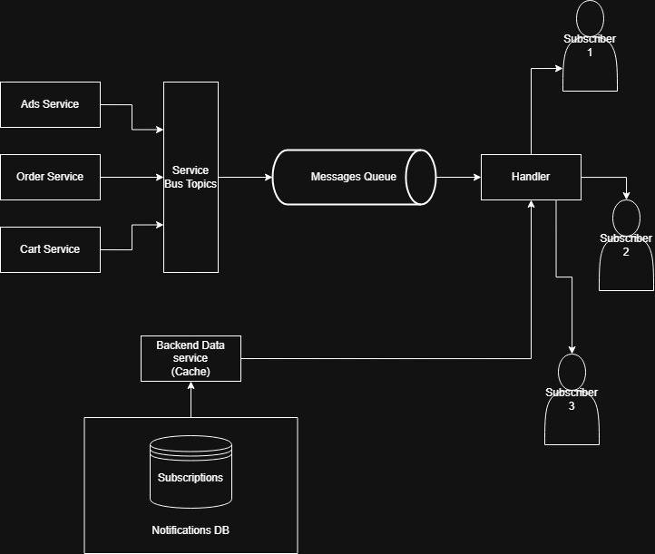

# ТЗ — Анализ требований  
**Интернет-магазин «Петрушка Зеленая»**

## Описание
Вам попал на руки фрагмент технического задания на разработку функционала **«Корзина»** для интернет-магазина «Петрушка Зеленая».

В ТЗ присутствуют логические противоречия, недочеты и неполные формулировки.

---

## Раздел ТЗ: Функционал корзины

1. Пользователь может добавить в корзину от 1 до 10 единиц одного товара.
2. Пользователь может изменить количество каждого товара в корзине не менее, чем до 1-го. Для удаления товара из корзины используется отдельная кнопка.
3. В корзине может находиться не более 5 различных товаров.
4. Суммарное количество всех товаров в корзине не может превышать 20 штук.
5. Товары в корзине могут быть разные.
6. При попытке добавить товар, превышающий лимиты, система показывает сообщение:  
   **«Лимит корзины превышен»**.
7. Цена на продукт фиксируется на момент добавления в корзину и не меняется.
8. На странице корзины отображается список товаров, их количество, цена за единицу и общая стоимость позиции.
9. Если пользователь уменьшает количество товара до 0, товар удаляется из корзины.
10. В корзине может быть реклама других продуктов.
11. Реклама товаров в корзине должна быть каждый будний день по утрам и вечерам.
13. Если цена на товар изменилась в каталоге, система должна автоматически обновить ее в корзине у всех пользователей.

---

## Что нужно сделать

1. Найти и перечислить все логические противоречия и недочеты в ТЗ.  
   Объяснить проблему для каждого пункта.
2. Предложить конкретные исправления и написать свою версию фрагмента ТЗ, логически завершенную и непротиворечивую.
3. Сформулировать уточняющие вопросы продукт-менеджеру или бизнес-заказчику.

---

## Логические противоречия

### Противоречие 1
- Пункт 1: от 1 до 10 единиц одного товара  
- Пункт 3: не более 5 различных товаров  

Максимально возможно 5 × 10 = 50 единиц товара,  
но в пункте 4 указано ограничение — **не более 20 штук суммарно**.

---

### Противоречие 2
- Пункт 3: не более 5 различных товаров  
- Пункт 5: товары в корзине могут быть разные  

Пункт 5 дублирует пункт 3 и не несет новой информации.

---

### Противоречие 3
Пункт 1 допускает добавление до 10 единиц товара,  
но не учитывает ситуацию, когда **на складе меньше 10 единиц**.

---

### Противоречие 4
Пункт 7: цена фиксируется и не меняется.

В случае повышения цены поставщиком магазин может уйти в минус,  
продавая товар по старой цене без учета новых издержек.

---

### Противоречие 6
- Пункт 2: количество нельзя уменьшить ниже 1, удаление — отдельной кнопкой  
- Пункт 9: при уменьшении количества до 0 товар удаляется  

Пункты противоречат друг другу по логике удаления товара.

---

### Противоречие 7
- Пункт 7: цена фиксируется и не меняется  
- Пункт 13: цена автоматически обновляется при изменении в каталоге  

Эти требования взаимоисключающие.

---

## Улучшения и предложения

### Улучшение 1 — Ограничения корзины
Ограничения:
- не более 10 единиц одного товара;
- не более 5 различных товаров;
- не более 20 единиц суммарно.

Не указано, **что делать пользователю**, если он хочет купить больше лимита.  
Стоит явно описать сценарий (например, оформление заказа для очистки корзины).

В целом ограниченная корзина:
- мешает посчитать общую стоимость желаемых покупок;
- может дезориентировать пользователя.

Если ограничения связаны с заказами, логичнее:
- автоматически распределять товары по нескольким заказам после оформления.

---

### Улучшение 2 — Реклама в корзине
Реклама в корзине:
- отвлекает пользователя от оформления заказа;
- вызывает сомнения в уже принятом решении.

Рекомендации лучше показывать:
- на странице конкретного товара,  
а не в корзине.
- это также позволит точнее настроить систему рекомаендаций 
---

### Улучшение 3 — Время показа рекламы
Требование показа рекламы:
- каждый будний день утром и вечером

Неясно, с чем связана эта логика.  
Если причина — рекламный бюджет, такие детали **не должны быть в ТЗ**,  
так как управляются рекламными сетями.

---

### Улучшение 4 — Удаление товара
Использовать механику:
- при уменьшении количества до 0 товар удаляется из корзины.

---

### Улучшение 5 — Обновление цены
Использовать механику:
- автоматического обновления цены в корзине при изменении в каталоге.

---

### Улучшение 6 — Массовые действия
Добавить функционал массовых операций:

- Кнопка **«Выбрать несколько»**
- Появляются чекбоксы и действия:
  - **Удалить**
  - **Купить**

**Удалить**  
→ выбранные товары удаляются, сумма корзины пересчитывается.

**Купить**  
→ выбранные товары добавляются в заказ, пользователь переходит к оформлению.

---

### Улучшение 7 — Итоговая сумма
Пункт 8 дополнить:
- отображением **общей стоимости всей корзины**.

---

## Ошибки в ТЗ

- Пропущен пункт **12**.

---

## Задание 2 — API

### Запрос

GET /api/v1/partner-stores


### Ответ
```json
{
  "stores": [
    {
      "id": 1,
      "name": "METRO",
      "delivery": {
        "type": "scheduled",
        "delivery_speed_min": "PT5H30M",
        "delivery_speed_max": "PT7H30M"
      },
      "photo": "data:image/png;base64,iVBORw0KGgoAAAANSUhEUgAA",
      "external_link": "https://metro-cc.ru/"
    },
    {
      "id": 2,
      "name": "Ашан",
      "delivery": {
        "type": "scheduled",
        "delivery_speed_min": "PT2H30M",
        "delivery_speed_max": "PT4H30M"
      },
      "photo": "data:image/png;base64,iVBORw0KGgoAAAANSUhEUgAA",
      "external_link": "https://www.auchan.ru/"
    },
    {
      "id": 3,
      "name": "ВкусВилл",
      "delivery": {
        "type": "fast",
        "delivery_speed_min": "20M",
        "delivery_speed_max": "60M"
      },
      "photo": "data:image/png;base64,iVBORw0KGgoAAAANSUhEUgAA",
      "external_link": "https://vkusvill.ru/"
    },
    {
      "id": 4,
      "name": "Виктория",
      "delivery": {
        "type": "scheduled",
        "delivery_speed_min": "PT1H30M",
        "delivery_speed_max": "PT3H30M"
      },
      "photo": "data:image/png;base64,iVBORw0KGgoAAAANSUhEUgAA",
      "external_link": "https://victoria-group.ru/"
    }
  ]
}

```
---

## Задание 3 — API

